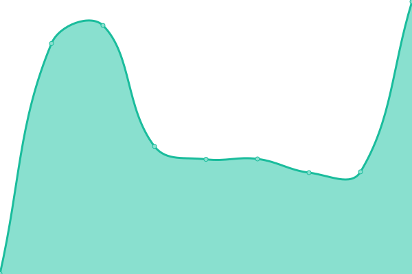
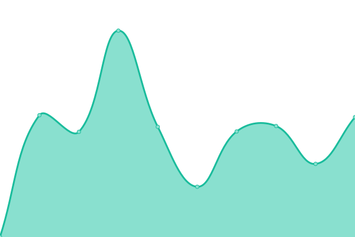

# 📈 [Live Status](https://status.buligadragos.ro/): <!--live status--> **🟧 Partial outage**

This repository contains the open-source uptime monitor and status page for [Buliga Dragos](buligadragos.ro), powered by [Upptime](https://github.com/upptime/upptime).

<!--start: status pages-->
<!-- This summary is generated by Upptime (https://github.com/upptime/upptime) -->
<!-- Do not edit this manually, your changes will be overwritten -->
<!-- prettier-ignore -->
| URL | Status | History | Response Time | Uptime |
| --- | ------ | ------- | ------------- | ------ |
|  [Portfolio](https://www.buligadragos.ro) | 🟩 Up | [portfolio.yml](https://github.com/buligadragos/UpTime/commits/HEAD/history/portfolio.yml) | 

 512ms
     
 | 

<a href="https://status.buligadragos.ro/history/portfolio">100.00%</a>
    

|  [GOTO Parking](https://gotoparking.ro) | 🟩 Up | [goto-parking.yml](https://github.com/buligadragos/UpTime/commits/HEAD/history/goto-parking.yml) | 

 1969ms
     
 | 

<a href="https://status.buligadragos.ro/history/goto-parking">99.50%</a>
    

|  [Our Collective Experience](http://www.ourcollectiveexperience.com/) | 🟥 Down | [our-collective-experience.yml](https://github.com/buligadragos/UpTime/commits/HEAD/history/our-collective-experience.yml) | 

 0ms
     
 | 

<a href="https://status.buligadragos.ro/history/our-collective-experience">0.00%</a>
    

|  [heartMap](https://heartmap.buligadragos.work/) | 🟥 Down | [heart-map.yml](https://github.com/buligadragos/UpTime/commits/HEAD/history/heart-map.yml) | 

 0ms
     
 | 

<a href="https://status.buligadragos.ro/history/heart-map">0.00%</a>
    

<!--end: status pages-->

## 📄 License

- Powered by: [Upptime](https://github.com/upptime/upptime)
- Code: [MIT](./LICENSE) © [Buliga Dragos](buligadragos.ro)
- Data in the `./history` directory: [Open Database License](https://opendatacommons.org/licenses/odbl/1-0/)
